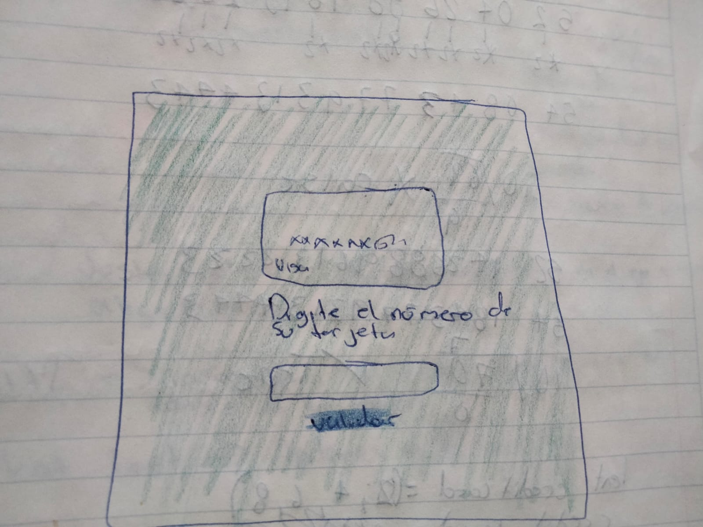

# validación de tarjeta de credito

* [1. Resumen](#1-Introducción)
* [2. HTML](#2-HTML)
* [3. Javascript](#3-Javascript)
* [4. CSS](#4-CSS)
* [7. Prototipo de baja fidelidad](#7-Prototipo-de-baja-fidelidad)

## Resumen
En este proyecto se trabajo con el algoritmo de luhn utilizando javascript el cual valida si una tarjeta de credito es valida o no para obtener un descuento en una tienda departamental. Posteriormente se creó una función de enmascaramiento para todos los numeros de la tarjeta excepto los ultimos 4.

## HTML
En el apartado de HTML se creo el contenido de la página web, como la implementación de un input en donde se ingresan los datos de la tarjeta. un boton con el proposito de determinar si la tarjeta es valida o no. 

## Javascript
En el apartado de javascript se creo la funcionalidad de la página web. se utilizaron dos carpetas de JS uno para crear las funciones y el otro para iterar de manera directa con el DOM. Para lograr el codigo y el enmascaramiento se utilizaron bucles de tipo for, condicionales de tipo if, else. Conversion de strings a arrays y eventos para llamar al DOM. 

## CSS
En el apartado de CSS se realizo todo el diseño de estilos. Se seleccionaron colores, tamaño, posiciones y tipo de letra para los divs del HTML, el botón y se agrego una imagen. 

## Prototipo de baja fidelidad

